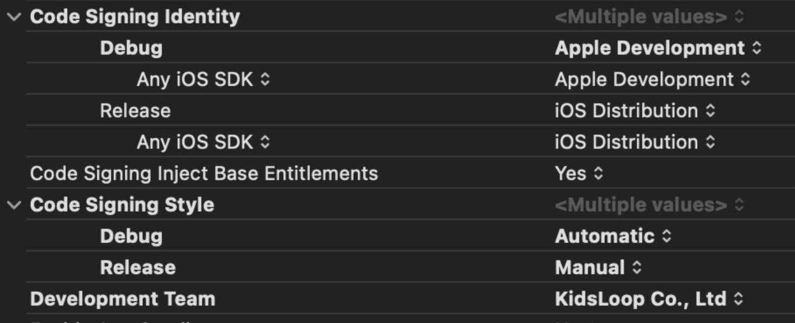

# Local Setup

## Prerequisites

-   Docker installed and running. [Download here](https://www.docker.com/products/docker-desktop).
-   Locally cloned versions of the folowing repositories:
    -   [kidsloop-live-server](https://bitbucket.org/calmisland/kidsloop-live-server)
    -   [kidsloop-sfu](https://bitbucket.org/calmisland/kidsloop-sfu)
    -   [kidsloop-sfu-gateway](https://bitbucket.org/calmisland/kidsloop-sfu-gateway)
-   git lfs setup
    -   follow installation [instructions](https://github.com/git-lfs/git-lfs/blob/main/INSTALLING.md#installing-packages)
    -   `git lfs install`

### Mac

Add the following to your `~/.bash_profile` file (or create the file if it doesn't exist)

```bash
export DEV_SECRET='iXtZx1D5AqEB0B9pfn+hRQ=='
```

_If you use a different terminal other than **Bash**, you might need to load the Bash config file into your terminal's config._

### Zsh

Add the following to `~/.zshenv` (or create the file if it doesn't exist)

```zsh
source ~/.bash_profile
```

## 1. `kidsloop-live-server`

Open up a terminal, and navigate to your local root of `kidsloop-live-server` and enter the following commands:

```sh
docker run --name some-redis -p 6379:6379 -d redis
docker run --name postgres -e POSTGRES_PASSWORD=PASSWORD -p 5432:5432 -d postgres
npm install
npm start
```

## 2. `kidsloop-sfu-gateway`

Open up a terminal, and navigate to your local root of `kidsloop-sfu-gateway` and enter the following commands:

```sh
npm install
npm start
```

## 3. `kidsloop-sfu`

Open up a terminal, and navigate to your local root of `kidsloop-sfu` and enter the following commands:

```sh
npm install
USE_IP=1 npm start
```

## 4. `kidsloop-live-frontend`

1. Add the following redirect config to your computer's `hosts` file

```host
local.alpha.kidsloop.net    localhost
```

2. Navigate to your local root of `kidsloop-live-frontend` and copy the contents of `env.example` (or fill out with the wanted values) and create a new file called `.env` and place it in the same folder:
3. Enter the following commands in the terminal:

```sh
npm start
```

### Connect to a Local Live Class **with a valid Access Cookie**

#### Generate a **Teacher** token

1. Go to https://hub.alpha.kidsloop.net
2. Sign in with an account that has a Teacher user
3. Navigate to `/schedule`
4. In the left toolbar, under Class Types, check the checkbox for "Live"
5. Click on an ongoing class in the calendar
6. Press the "Go Live"-button in the dialog that pops up
7. Copy the `TOKEN` from the address bar (`.../?token=TOKEN`)
8. Navigate to jwt.io
9. Change the "Algorithm" to "HS256"
10. Paste the `TOKEN` in the "Encoded" section
11. In the "HEADER" section, add `"issuer": "calmid-debug"`
12. In the "VERIFY SIGNATURE" section, insert the `DEV_SECRET` as the `your-256-bit-secret`
13. In the "PAYLOAD" section, change the `"iss"` value to `"calmid-debug"`
14. Copy the newly generated `TOKEN` from the "Encoded" section
15. Open up a new tab and browse to https://local.alpha.kidsloop.net:8082/?token=TOKEN

#### Generate a **Student** token

1. Follow the all same steps in "Generate a **Teacher** token" until and including **Step 13**
2. In the "PAYLOAD" section, change the `"teacher"` value to `false`
3. Copy the newly generated `TOKEN` from the "Encoded" section
4. Open up a new tab and browse to https://local.alpha.kidsloop.net:8082/?token=TOKEN

### Connect to a Local Live Class **and bypass the valid Access Cookie check**

1. In `kidsloop-live-server/src/main.ts` comment out the usage of:
    - `checkToken` (lines ~ 58-64)
    - `checkToken` (lines ~ 138-144)
2. Restart `kidsloop-live-server`
3. In `kidsloop-live-frontend/webpack.config.js` change `module.exports.devServer.https` to `false`
4. Restart `kidsloop-live-frontend`

_NOTE: When joining a class without a valid Access Cookie, you need to use the browser Safari. After you have successfully joined you can copy the web address in Safari and paste it into Chrome or any other browser._

# FAQ

## Build Issues

**I have trouble building `kidsloop-live-frontend` due to issues cloning `kidsloop-canvas`**

Try adjusting your `.gitconfig` to have the following information:

```
[url "ssh://git@bitbucket.org"]
	insteadOf = https://bitbucket.org
```

This should prevent npm from trying to use https when pulling down repos from bitbucket.

## Live Class Issues

**I have old Users (aka Ghost Users) that never leave my Class**

SSH (attach shell) to the running `redis` docker container, and run the command:

```sh
redis-cli flushall
```

# Cordova

This section describes how to prepare and build the cordova apps for iOS and Android inside this repository.

## Prerequisites

### Generic

```sh
mkdir www
```

This folder is required for Cordova to recognise the project.

Install the Cordova CLI by following these [instructions](https://cordova.apache.org/docs/en/10.x/guide/cli/index.html#installing-the-cordova-cli).

Once these are complete, move onto the steps described for the desired platform to ensure all prerequisites are installed on the developer machine for each platform.

### Android

**Official Cordova documentation**

The easiest way to install all the Android requirements is to follow the official cordova documentation. This can be found at this URL: https://cordova.apache.org/docs/en/10.x/guide/platforms/android/index.html#installing-the-requirements

**Verifying all the requirements is in place**

Run the following command to verify the Android prerequisites are available and configured:

```sh
cordova requirements android
```

Fix any missing requirements the previous command detected and then move on to the Building section.

### iOS

**Official Cordova documentation**

The easiest way to install all the iOS requirements is to follow the official cordova documentation. This can be found at this URL: https://cordova.apache.org/docs/en/10.x/guide/platforms/ios/index.html#installing-the-requirements

**Verifying all the requirements is in place**

Run the following command to verify the iOS prerequisites are available and configured:

```sh
cordova requirements ios
```

Fix any missing requirements the previous command detected and then move on to the Building section.

## Building for Development

Building for development is separated in two different steps. One step to generate the native platform project and files and another step to build the native applications. In the KidsLoop Live repository there's scripts to help do these steps.

### Android

Execute the following command to build a development `apk` file:

```sh
./scripts/build-android-development.sh
```

If there wasn't any errors the command will produce an `apk` file in this location:

```
./platforms/android/app/build/outputs/apk/debug/app-debug.apk
```

This file can be installed on device or emulator using the command:

```sh
adb install -r ./platforms/android/app/build/outputs/apk/debug/app-debug.apk
```

### iOS

Execute the following command to build and open a XCode project:

```sh
./scripts/build-ios-development.sh
```

If there wasn't any errors the command will open the generated XCode project. Use the XCode project to debug or archive the `ipa` file as usual.

## Building for Production

### Android

Execute the following command to build a production `aab` file:

```sh
./scripts/build-android-release.sh
```

If there wasn't any errors the command will produce an `aab` file in this location:

```
./platforms/android/app/build/outputs/bundle/release/app-release.aab
```

This file can then be uploaded to Google Play using the Google Play developer console.

### iOS

Execute the following command to build and open a XCode project:

```sh
./scripts/build-ios-development.sh
```

If there wasn't any errors the command will open the generated XCode project.

**Add build phase script to remove x86 architectures from included frameworks**

Go to the project properties and `Build Phases` page in XCode. Add the following script as a last `Build Phase`:

```sh
echo "Target architectures: $ARCHS"

APP_PATH="${TARGET_BUILD_DIR}/${WRAPPER_NAME}"

find "$APP_PATH" -name '*.framework' -type d | while read -r FRAMEWORK
do
FRAMEWORK_EXECUTABLE_NAME=$(defaults read "$FRAMEWORK/Info.plist" CFBundleExecutable)
FRAMEWORK_EXECUTABLE_PATH="$FRAMEWORK/$FRAMEWORK_EXECUTABLE_NAME"
echo "Executable is $FRAMEWORK_EXECUTABLE_PATH"
echo $(lipo -info "$FRAMEWORK_EXECUTABLE_PATH")

FRAMEWORK_TMP_PATH="$FRAMEWORK_EXECUTABLE_PATH-tmp"

# remove simulator's archs if location is not simulator's directory
case "${TARGET_BUILD_DIR}" in
*"iphonesimulator")
    echo "No need to remove archs"
    ;;
*)
    if $(lipo "$FRAMEWORK_EXECUTABLE_PATH" -verify_arch "i386") ; then
    lipo -output "$FRAMEWORK_TMP_PATH" -remove "i386" "$FRAMEWORK_EXECUTABLE_PATH"
    echo "i386 architecture removed"
    rm "$FRAMEWORK_EXECUTABLE_PATH"
    mv "$FRAMEWORK_TMP_PATH" "$FRAMEWORK_EXECUTABLE_PATH"
    fi
    if $(lipo "$FRAMEWORK_EXECUTABLE_PATH" -verify_arch "x86_64") ; then
    lipo -output "$FRAMEWORK_TMP_PATH" -remove "x86_64" "$FRAMEWORK_EXECUTABLE_PATH"
    echo "x86_64 architecture removed"
    rm "$FRAMEWORK_EXECUTABLE_PATH"
    mv "$FRAMEWORK_TMP_PATH" "$FRAMEWORK_EXECUTABLE_PATH"
    fi
    ;;
esac

echo "Completed for executable $FRAMEWORK_EXECUTABLE_PATH"
echo $(lipo -info "$FRAMEWORK_EXECUTABLE_PATH")

done
```

**Disable Validate Workspace**

Find the settings `Validate Workspace` in XCode project settings. Set the value to `No`. Doing this will prevent XCode failing the build due to issue with the included `cordova-plugin-iosrtc` framework.

**Configure Code Signing**

The KidsLoop distribution certificate with private key have to be in the `Key Chain` before doing this step. Configure the code signing as illustrated in this image:



**Archive the iOS binary**

Now it's possible to archive the binary and then distribute and upload to App Store as usual.
